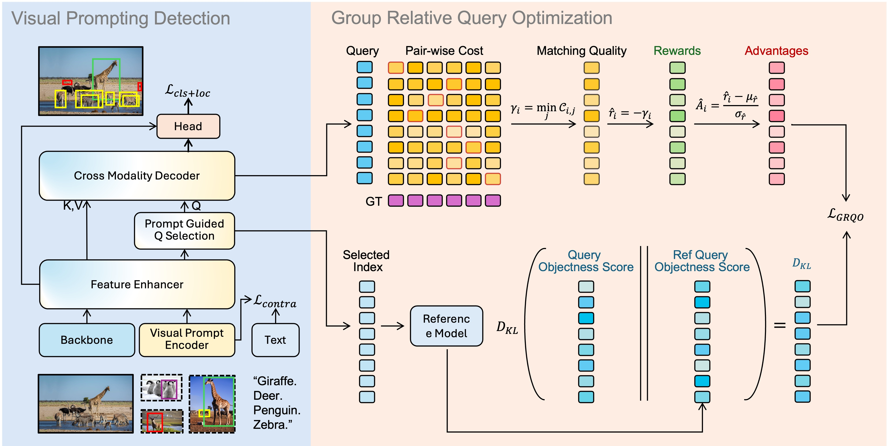

<h1> <em>DINO-R1</em>: Incentivizing Reasoning Capability in Vision Foundation Models</h1>


[Chenbin Pan](https://scholar.google.com/citations?user=Ln6sN1IAAAAJ&hl=en)<sup>1,2</sup>, [Wenbin He](https://hewenbin.github.io/)<sup>1,2</sup>, [Zhengzhong Tu](https://vztu.github.io/)<sup>3</sup>, [Liu Ren](https://www.liu-ren.com/)<sup>1,2</sup>

> <sup>1</sup>Bosch Research North America
> <sup>2</sup>Bosch Center for Artificial Intelligence (BCAI)
> <sup>3</sup>Texas A&M University

[](https://arxiv.org/pdf/2505.24025)
[](https://Christinepan881.github.io/DINO-R1)


## 📄 Abstract
> The recent explosive interest in the reasoning capabilities of large language models, such as DeepSeek-R1, has demonstrated remarkable success through reinforcement learning-based fine-tuning frameworks, exemplified by methods like Group Relative Policy Optimization (GRPO). However, such reasoning abilities remain underexplored and notably absent in vision foundation models, including representation models like the DINO series. In this work, we propose <strong><em>DINO-R1</em></strong>, the first such attempt to incentivize visual in-context reasoning capabilities of vision foundation models using reinforcement learning. Specifically, <strong><em>DINO-R1</em></strong> introduces Group Relative Query Optimization (GRQO), a novel reinforcement-style training strategy explicitly designed for query-based representation models, which computes query-level rewards based on group-normalized alignment quality. We also apply KL-regularization to stabilize the objectness distribution to reduce the training instability. This joint optimization enables dense and expressive supervision across queries while mitigating overfitting and distributional drift. Building upon Grounding-DINO, we train a series of <strong><em>DINO-R1</em></strong> family models that integrate a visual prompt encoder and a visual-guided query selection mechanism. Extensive experiments on COCO, LVIS, and ODinW demonstrate that <strong><em>DINO-R1</em></strong> significantly outperforms supervised fine-tuning baselines, achieving strong generalization in both open-vocabulary and closed-set visual prompting scenarios.



## 📌 Citation
```bibtex
@article{pan2025dino,
  title={DINO-R1: Incentivizing Reasoning Capability in Vision Foundation Models},
  author={Pan, Chenbin and He, Wenbin and Tu, Zhengzhong and Ren, Liu},
  journal={arXiv preprint arXiv:2505.24025},
  year={2025}
}
